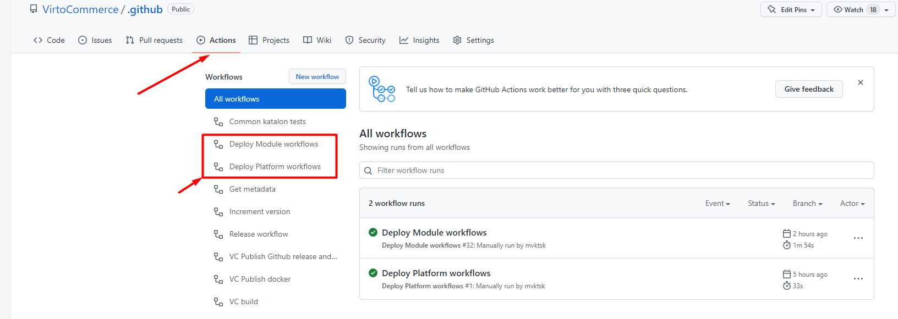
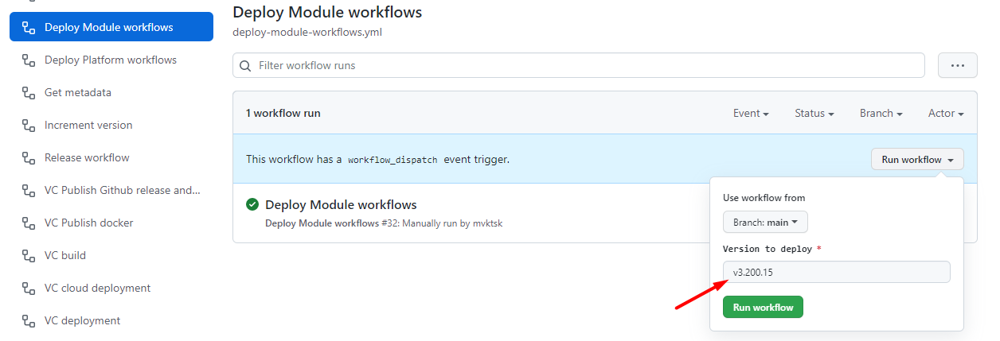
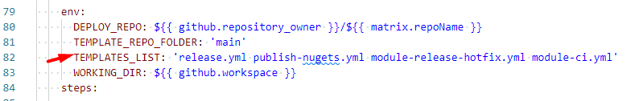

# VirtoCommerce workflows

Default workflow templates and reusable workflows for VirtoCommerce platform/modules.

## Workflow templates

Actual workflow templates are located in `workflow-templates` folder.

Module workflow templates include:

- module-ci.yml - VirtoCommerce Module CI workflow template.
- module-release-hotfix.yml - VirtoCommerce Module release hotfix workflow template.
- release.yml - VirtoCommerce Release workflow template.
- publish-nugets.yml VirtoCommerce nugets publish workflow template.

Platform workflow templates include:

- platform-ci.yml - VirtoCommerce Platform CI workflow template.
- platform-release-hotfix.yml - VirtoCommerce Platform release hotfix workflow template.
- release.yml - VirtoCommerce Release workflow template.
- publish-nugets.yml - VirtoCommerce nugets publish workflow template.

`Note` release.yml and publish-nugets.yml used for both VirtoCommerce modules and platform.

## Update workflow templates

To update workflow templates:

- Update template in `workflow-templates` folder.
- Increment version in a template.
- Add a version tag for releases of your workflows.

 ```git
    git tag -a -m "My template release" v3.200.24
    git push --follow-tags
 ```

- Run `Deploy Module workflows` to update workflows in modules or `Deploy Platform workflows` to update workflows in platform.



- Specify version tag in `Version to deploy` input parameter.



You can also use `main` as version tag to use latest version from the main branch for update.

## Add new workflow templates

- Add new workflow template to `workflow-templates` folder as described in the [article](https://docs.github.com/en/actions/using-workflows/creating-starter-workflows-for-your-organization#creating-a-starter-workflow).
- Add new workflow file name to `TEMPLATES_LIST` environment variable in `deploy-module-workflows.yml`, `deploy-platform-workflows.yml` or both workflows for deploy new workflow to the repositories.


