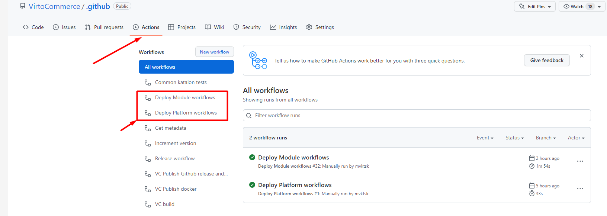
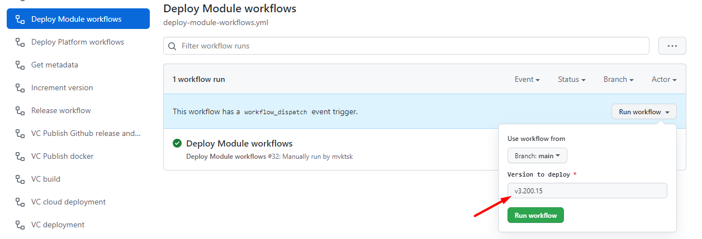
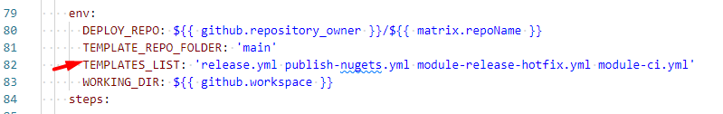

# Virto Commerce Workflows

Default workflow templates and reusable workflows for VirtoCommerce platform/modules.

## Workflow templates

Actual workflow templates are located in `workflow-templates` folder.

Module workflow templates include:

- module-ci.yml - VirtoCommerce Module CI workflow template.
- module-release-hotfix.yml - VirtoCommerce Module release hotfix workflow template.
- release.yml - VirtoCommerce Release workflow template.
- publish-nugets.yml VirtoCommerce nugets publish workflow template.

Platform workflow templates moved to the vc-platform repository:

- platform-ci.yml - VirtoCommerce Platform CI workflow template.
- platform-release-hotfix.yml - VirtoCommerce Platform release hotfix workflow template.
- release.yml - VirtoCommerce Release workflow template.
- publish-nugets.yml - VirtoCommerce nugets publish workflow template.

`Note` release.yml and publish-nugets.yml used for both VirtoCommerce modules and platform.

## Update workflow templates

To update workflow templates:

- Update template in `workflow-templates` folder.
- Increment version in a template.
- Add a version tag for releases of your workflows.
- Bump default version for module workflows in deploy-module-workflows.yml

 ```git
    git tag -a -m "My template release" v3.800.0
    git push --follow-tags
 ```

- Run `Deploy Module workflows` to update workflows in modules or `Deploy Platform workflows` to update workflows in platform.



- Specify version tag in `Version to deploy` input parameter.



You can also use `main` as version tag to use latest version from the main branch for update.

- Update composable workflow versions in repositories:
  - vc-modules
  - vc-platform
  - vc-frontend


## Add new workflow templates

- Add new workflow template to `workflow-templates` folder as described in the [article](https://docs.github.com/en/actions/using-workflows/creating-starter-workflows-for-your-organization#creating-a-starter-workflow).
- Add new workflow file name to `TEMPLATES_LIST` environment variable in `deploy-module-workflows.yml`, `deploy-platform-workflows.yml` or both workflows for deploy new workflow to the repositories.



## Distribute common build props

Alongside workflow templates, shared MSBuild settings are distributed to module repos. The canonical files live in the `common-build-props` folder (sibling of `workflow-templates`) and are fully owned here — for example `nuget-audit.props`, which enables NuGet vulnerable-dependency auditing (`NuGetAudit` / NU190x) with a per-advisory suppression list.

The `Deploy Module build props` workflow (`deploy-module-build-props.yml`) copies these files into each module's repository root and ensures the module's own `Directory.Build.props` **imports** them via a marker-delimited managed block:

```xml
<!-- BEGIN managed: VirtoCommerce common build props -->
<Import Project="$(MSBuildThisFileDirectory)nuget-audit.props" Condition="Exists('$(MSBuildThisFileDirectory)nuget-audit.props')" />
<!-- END managed: VirtoCommerce common build props -->
```

The props files are imported, never merged, so each module keeps its own settings (`VersionPrefix`, `TreatWarningsAsErrors`, etc.). Only the region between the markers is managed; everything else in the module's `Directory.Build.props` is left untouched, and the deploy fails loudly if a module has no `Directory.Build.props` rather than fabricating one.

The copy-and-import logic lives in a single shared script, `scripts/ensure-build-props-import.sh`, used by both `deploy-module-build-props.yml` (distribute to existing modules) and `create-module-repository.yml` (scaffold at creation), so a new module is born with the props already imported.

To change the distributed settings: edit the file under `common-build-props`, tag a new version, and run `Deploy Module build props` with that version — the same version/tag flow as workflow templates. To distribute an additional props file, add its name to the `BUILD_PROPS_LIST` environment variable in `deploy-module-build-props.yml`.

## Shared module list

The list of module repositories that deploy workflows fan out over lives in a single file, `modules.json` (repo root), consumed by both `deploy-module-workflows.yml` and `deploy-module-build-props.yml`. Each workflow has a small `prepare` job that reads `modules.json` and feeds it into the deploy matrix via `fromJson`. Add or remove a module in one place — `modules.json` — and every dependent workflow picks it up.

## Supply-chain security: pinned third-party actions

Every third-party `uses:` reference in this repo (anything not under `VirtoCommerce/*`) is pinned to a full 40-character commit SHA with a trailing `# tag` comment, per the [GitHub Actions hardening guide](https://docs.github.com/en/actions/security-for-github-actions/security-guides/security-hardening-for-github-actions#using-third-party-actions). Tags are mutable; SHAs are not.

```yaml
# Correct
uses: actions/checkout@de0fac2e4500dabe0009e67214ff5f5447ce83dd # v6

# Rejected by CI
uses: actions/checkout@v6
```

This applies to both reusable workflows in `.github/workflows/` and starter workflows in `workflow-templates/` (the latter inherit pinned SHAs when copied into module repos).

**How updates happen**

- **Dependabot** (`.github/dependabot.yml`) scans `.github/workflows/` weekly and opens grouped PRs bumping SHA + trailing comment when upstream cuts a new tag. Dependabot's `github-actions` ecosystem does NOT scan `workflow-templates/`.
- **Auto-update for templates** (`.github/workflows/auto-update-templates.yml`) runs Mondays 08:00 UTC, executes `pinact run -update` against `workflow-templates/*.yml`, and opens a PR with the SHA bumps. Closes the gap Dependabot can't cover.
- **Pin-check CI** (`.github/workflows/pin-check.yml`) runs `pinact run -check` on every PR that touches workflows or templates. PRs with unpinned third-party `uses:` lines fail.
- **Scope** is configured in [`.pinact.yaml`](.pinact.yaml) — `VirtoCommerce/*` is intentionally ignored (internal, not third-party).

**For contributors**

- When adding a new third-party action, write the SHA, not the tag. Quick lookup:

  ```sh
  gh api repos/OWNER/REPO/commits/TAG --jq '.sha'
  ```

- `VirtoCommerce/vc-github-actions/<dir>@master` and `VirtoCommerce/.github/.../*.yml@vN.N.N` refs remain version-/branch-pinned as before.
- New module repos created via `create-module-repository.yml` inherit pinned templates but do not get their own Dependabot config — SHAs there will go stale unless the module repo adds one.
